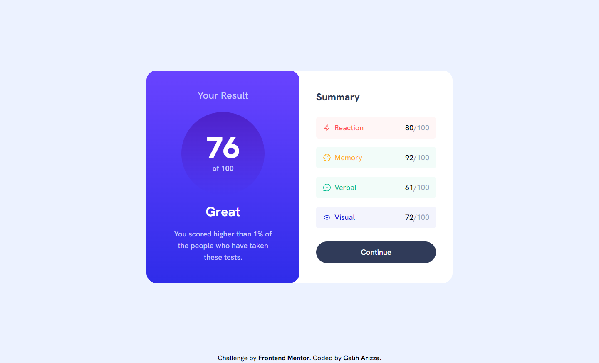

# Frontend Mentor - Results summary component solution

This is a solution to the [Results summary component challenge on Frontend Mentor](https://www.frontendmentor.io/challenges/results-summary-component-CE_K6s0maV). Frontend Mentor challenges help you improve your coding skills by building realistic projects.

## Table of contents

- [Overview](#overview)
  - [The challenge](#the-challenge)
  - [Screenshot](#screenshot)
  - [Links](#links)
- [My process](#my-process)
  - [Built with](#built-with)
  - [What I learned](#what-i-learned)
  - [Continued development](#continued-development)
  - [Useful resources](#useful-resources)
- [Author](#author)
- [Acknowledgments](#acknowledgments)

## Overview

### The challenge

Users should be able to:

- View the optimal layout for the interface depending on their device's screen size
- See hover and focus states for all interactive elements on the page

### Screenshot

### Links

- Solution URL: [https://github.com/chadittya/results-summary-component](https://github.com/chadittya/results-summary-component)
- Live Site URL: [https://results-summary-component-roan-tau.vercel.app/](https://results-summary-component-roan-tau.vercel.app/)

## My process

### Built with

- Semantic HTML5 markup
- CSS custom properties
- Flexbox
- [React](https://reactjs.org/) - JS library
- [Next.js](https://nextjs.org/) - React framework
- [tailwind CSS](https://tailwindcss.com/) - For styles

### What I learned

Through building this project, I learned several valuable lessons about working with JSON and highlighting code in Next.js 13. Some of the key takeaways include:

1. The JSON.parse() method is a powerful tool for converting JSON strings into JavaScript objects that can be easily manipulated and displayed on a webpage.
2. Next.js 13's built-in support for server-side syntax highlighting using react-syntax-highlighter allows for easy integration of highlighted code snippets into a project.
3. When working with Tailwind CSS, it's important to understand how to conditionally apply styles based on data values. In this project, I used conditional classes to style category labels based on their values.

Overall, this project helped me improve my skills in parsing JSON, styling with Tailwind CSS, and working with Next.js 13's latest features.

## Author

- Website - [Galih Arizza github](https://github.com/chadittya)
- Frontend Mentor - [@chadittya](https://www.frontendmentor.io/profile/chadittya)
- Twitter - [@galiharizza](https://www.twitter.com/galiharizza)
